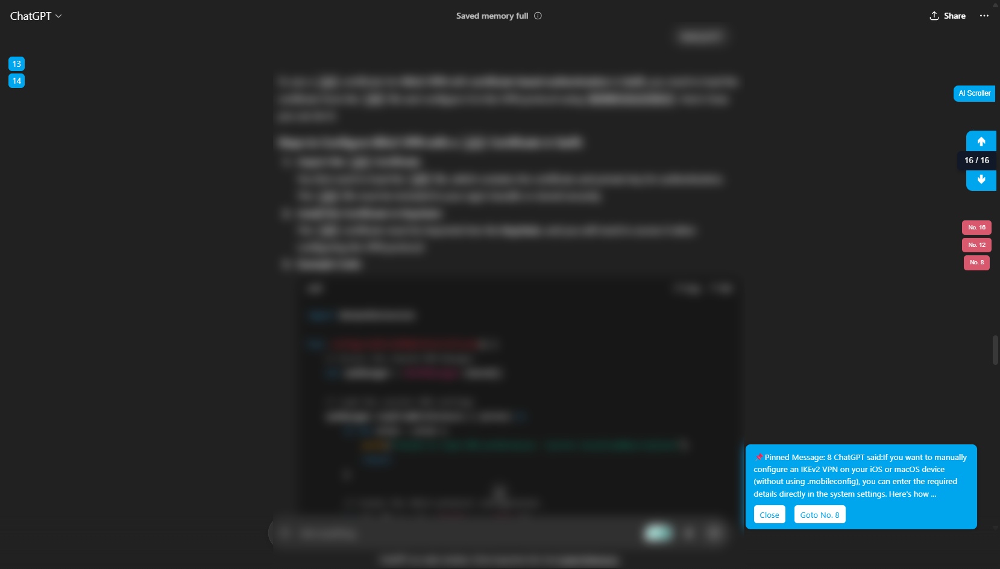
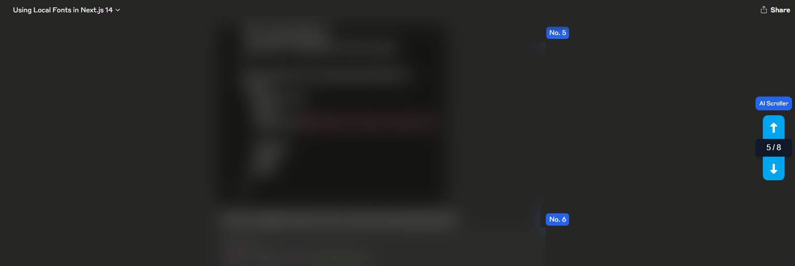
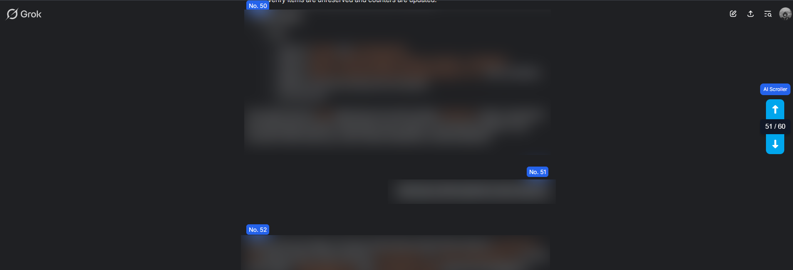

# AI Chat Scroller 🚀

**AI Chat Scroller** is a lightweight Chrome Extension that enhances your experience with AI chat platforms like ChatGPT, Grok, and Claude.

### ✨ Features
- Auto-number AI messages in chat
- Scroll through messages with up/down buttons
- Toggle UI visibility
- Remembers visibility state across sessions
- Only runs on supported AI chat platforms

### 🧠 Supported Platforms
- [ChatGPT](https://chatgpt.com/)
- [Grok](https://grok.com/chat/)
- [Claude](https://claude.ai/chat/)

### 📸 Screenshots

#### ChatGPT

#### Claude

#### Grok

### 🔒 Privacy
This extension does **not** collect any personal data or track your activity.

### 📦 Installation (for Developers)
1. Clone or download this repo
2. Open `chrome://extensions/` in Chrome
3. Enable **Developer Mode**
4. Click **Load unpacked** and select the extension folder

---

Created By [H120](https://github.com/H120)
