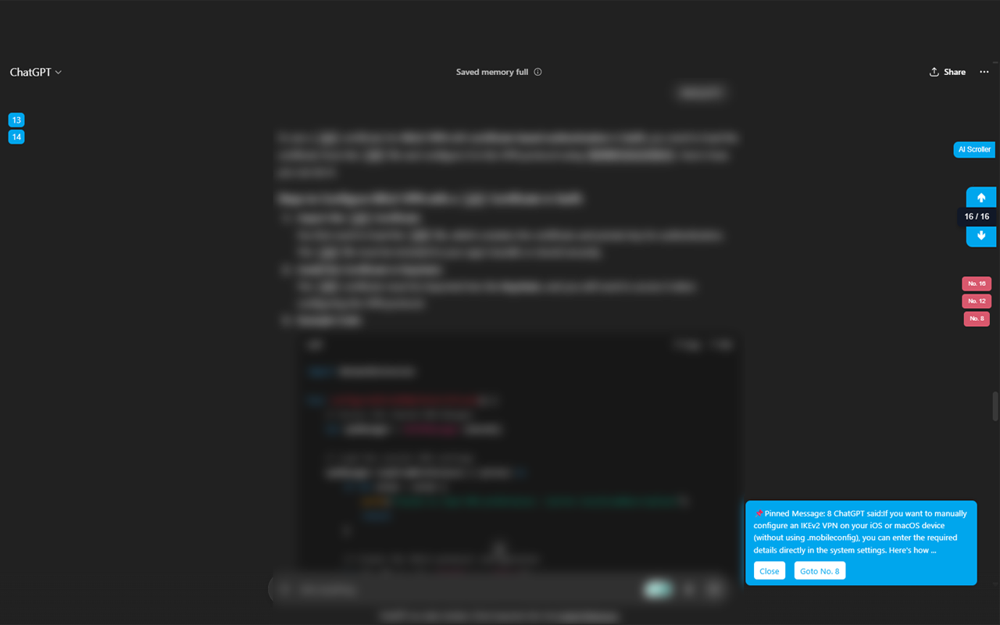

# AI Chat Scroller

**AI Chat Scroller** is a lightweight Chrome extension that enhances your experience on popular AI chat platforms such as ChatGPT, Grok, Claude, and Copilot.

### ✨ Features
- Auto-numbers AI messages in chat
- Scroll through messages using up/down buttons
- Toggle the UI on or off
- Remembers UI state across sessions
- Bookmark messages for quick reference
- Runs only on supported AI chat Websites

### 🧠 Supported Platforms
- [ChatGPT](https://chatgpt.com/)
- [Grok](https://grok.com/chat/)
- [Claude](https://claude.ai/chat/)
- [Copilot](https://copilot.microsoft.com/)

### 📸 Screenshots

#### ChatGPT

#### Claude

#### Grok

### 🔒 Privacy
This extension **does not** collect any personal data or track your activity.

### 📦 Installation (for Developers)
1. Clone or download this repository
2. Open `chrome://extensions/` in Chrome
3. Enable **Developer Mode**
4. Click **Load unpacked** and select the extension folder

---

Created by [H120](https://github.com/H120)